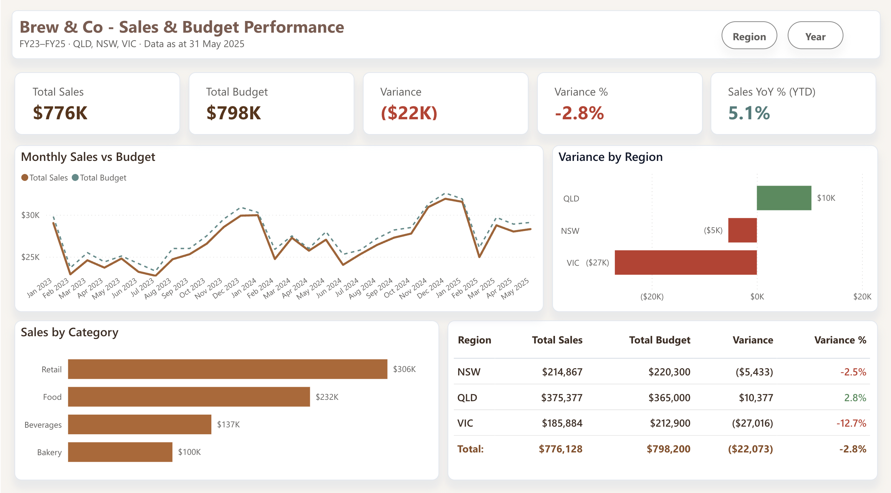
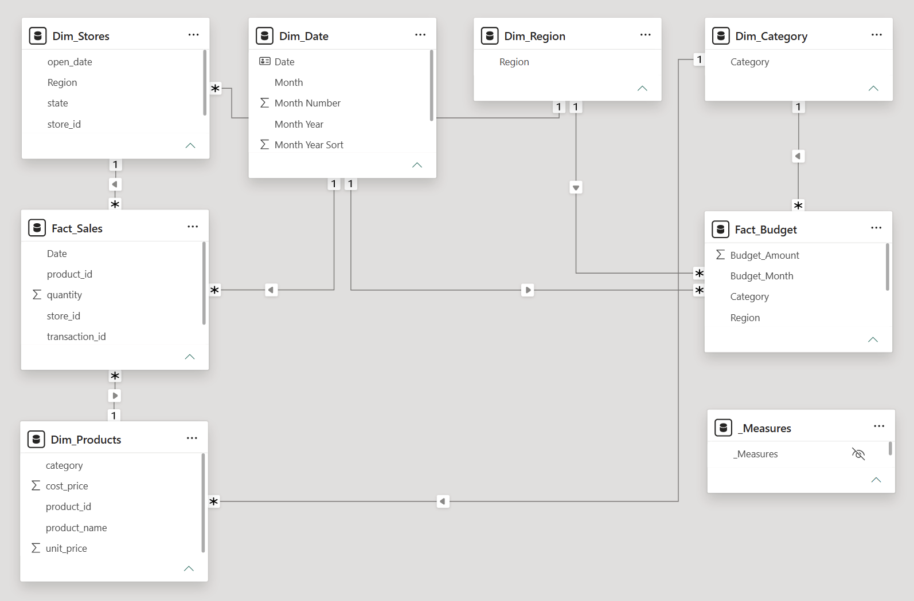

# Brew & Co — Sales & Budget Performance Dashboard

An end-to-end Power BI project: messy multi-source data → refreshable Power Query ETL → star-schema model with conformed dimensions → DAX time intelligence → executive dashboard.

**🔗 Live interactive report:** [View on Power BI]
https://app.fabric.microsoft.com/view?r=eyJrIjoiNzViYzNhY2EtZmIzZS00ODhhLTljNjgtY2YwMTcyNzhhNjMzIiwidCI6ImJkZTczODM5LWY2OTQtNDI3MC05ZmExLTQxNTNkNzQ2OTdkZCJ9

---

## The business question

A fictional Australian café & retail group (8 stores across QLD, NSW and VIC) tracks actual sales against monthly budget. Finance was reconciling the two manually in Excel each month. This project turns that reconciliation into a self-service analytics product.

## Key findings

The group finished at **97.2% of budget** — $776,128 actual vs $798,200 target (**−$22,072 / −2.8%**).

| Region | Actual | Budget | Variance | Attainment |
|---|---|---|---|---|
| QLD | $375,377 | $365,000 | +$10,377 | **103%** |
| NSW | $214,867 | $220,300 | −$5,433 | 98% |
| VIC | $185,884 | $212,900 | −$27,016 | **87%** |

**Excluding VIC, the group beat budget by $4,944.** One region accounted for more than the entire shortfall — while like-for-like sales grew **+5.1% YoY** (Jan–May 2025 vs 2024). The data reframes the management question from *"why did we miss budget?"* to *"what is happening in Victoria?"* — a demand problem and an execution problem have very different remedies.

## The data problem

The source extracts were deliberately messy, mirroring real operational systems:

- **~79,500 transaction rows** over 2.5 years with dates stored as text in *mixed formats* (`dd/mm/yyyy` and ISO `yyyy-mm-dd` in the same column)
- Duplicate transactions, blank product references, refunds recorded as negative quantities
- Store regions spelled seven ways: `QLD`, `Qld`, `Queensland`, `NSW`, `N.S.W.`, `VIC`, `Vic`
- Budget held at a **different grain** than sales (monthly × region vs daily × store) with **different category names** (`Drinks` vs `Beverages`, `Merchandise` vs `Retail`)

## The solution

**Power Query (M):** locale-aware date parsing with `try ... otherwise` fallback for mixed formats, deduplication on transaction ID, text standardisation, conditional-column mapping to a canonical category set. Fully refreshable — zero manual steps.

**Data model:** star schema with two fact tables (`Fact_Sales`, `Fact_Budget`) at different grains, integrated through **conformed dimensions** (`Dim_Region`, `Dim_Category`) so a single slicer filters both facts correctly. Dedicated marked `Dim_Date` table.

**DAX:** measure layer covering Variance / Variance %, `SAMEPERIODLASTYEAR` YoY, MoM, calendar YTD, **Australian fiscal YTD (July–June)**, and a like-for-like YTD-vs-prior-YTD comparison using variables. All measures in a dedicated `_Measures` table. See [docs/dax_measures.md](docs/dax_measures.md).

**Report:** executive page with KPI cards (rules-based conditional colour), actual-vs-budget trend, diverging variance chart, bookmark-driven pop-out slicer panels, and edit-interactions tuned so the regional comparison stays in context when filtered.

## Repository contents

| Path | Contents |
|---|---|
| `data/` | Source CSVs (synthetic, generated for this project) |
| `docs/data_dictionary.md` | Every table and column, with the deliberate data-quality issues catalogued |
| `docs/dax_measures.md` | All DAX measures with explanations |
| `docs/build_notes.md` | How the model was built, step by step, and the design decisions |
| `theme/BrewAndCo_Theme.json` | Custom Power BI theme (semantic colour system) |
| `images/` | Dashboard and model screenshots |
| `BrewAndCo.pbix` | The Power BI Desktop file |

## Tools

Power BI Desktop · Power Query (M) · DAX · Publish to web

---

*All data in this project is synthetic. No real business data is used. Report published via Publish to web, which is appropriate here precisely because the data is synthetic — real business data would require secure sharing with row-level security instead.*
